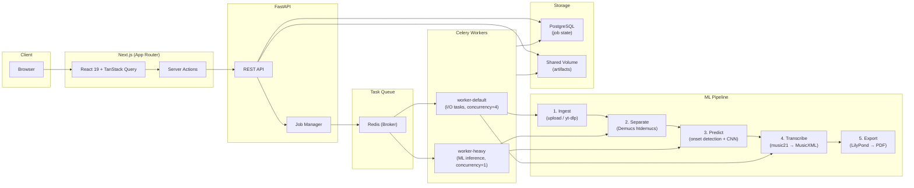

# DrumScribe

**Automatic drum transcription** — upload an audio file or paste a YouTube link, get drum sheet music (MusicXML + PDF).

A full-stack ML application that isolates drums from a mix using source separation, classifies individual hits with a CNN, and quantizes the output to standard music notation.

## System Architecture



## Tech Stack

| Layer | Technology | Why |
|-------|-----------|-----|
| **API** | FastAPI (Python 3.11) | Async I/O for concurrent job polling; auto-generated OpenAPI docs; Pydantic validation |
| **Task Queue** | Celery + Redis | Decoupled worker pools — I/O-bound tasks (ingest, export) run at high concurrency while memory-intensive ML tasks (Demucs at ~3 GB RSS, CNN inference) run at `concurrency=1` with `max-memory-per-child` recycling |
| **Frontend** | Next.js 16, React 19, TypeScript | Server Actions for secure job creation (BFF pattern); TanStack Query for polling; OpenSheetMusicDisplay for in-browser MusicXML rendering |
| **ML** | Demucs (source separation), Keras CNN (hit classification), madmom + librosa (BPM detection), music21 (notation) | Replicates [AnNOTEator](https://github.com/cb-42/AnNOTEator)'s research pipeline, adapted for production with singleton model loading, atomic file writes, and structured error propagation |
| **Observability** | Prometheus, OpenTelemetry, Jaeger, structlog | Distributed tracing across API → Celery chain; JSON-structured logs; per-task latency histograms |
| **Infrastructure** | Docker Compose, GitHub Actions | Multi-stage builds with SHA-pinned base images; Trivy CVE scanning; YAML anchors for DRY config; read-only containers with `cap_drop: ALL` |

## Engineering Highlights

- **Decoupled worker pools** — `worker-default` (4 concurrent, 512 MB limit) handles I/O tasks; `worker-heavy` (1 concurrent, 4 GB limit) handles Demucs source separation and CNN inference. This prevents OOM kills from blocking the entire pipeline.
- **ML model lifecycle** — Workers auto-download model weights from HTTP/S3 on first start, with SHA256 integrity verification and version-triggered cache invalidation. No model files in the repo.
- **Atomic artifact writes** — All file outputs use `tempfile` → `os.replace()` to prevent corrupt artifacts on worker crash or OOM kill mid-write.
- **Security hardening** — All containers run as non-root (UID 1001), read-only filesystems, `cap_drop: ALL`, `no-new-privileges`, resource limits on every service.
- **BFF pattern** — Frontend uses `API_URL` (internal Docker network) for server-side requests and `NEXT_PUBLIC_API_URL` (public) for client-side, avoiding CORS complexity.

## Quick Start

```bash
cp .env.example .env
docker compose up --build
```

| Service | URL |
|---------|-----|
| Frontend | [localhost:3000](http://localhost:3000) |
| API Docs | [localhost:8000/docs](http://localhost:8000/docs) |
| Metrics | [localhost:8000/metrics](http://localhost:8000/metrics) |

## API

| Method | Endpoint | Description |
|--------|----------|-------------|
| `POST` | `/api/v1/jobs` | Create transcription job (file upload or YouTube URL) |
| `GET` | `/api/v1/jobs/{id}` | Poll job status + progress |
| `GET` | `/api/v1/jobs/{id}/result` | Result payload (hits, BPM, confidence) |
| `GET` | `/api/v1/jobs/{id}/download/{fmt}` | Download `musicxml` or `pdf` |
| `DELETE` | `/api/v1/jobs/{id}` | Cancel / delete job |
| `GET` | `/api/v1/health` | Health check (DB, Redis, model status) |

## Project Structure

```
backend/
  app/
    api/v1/routes/        REST endpoints (jobs, health)
    ml/
      engine.py           Demucs separation + CNN prediction pipeline
      registry.py         Model resolution, caching, remote download
    services/             Transcription, export, audio ingestion, webhooks
    storage/              Storage abstraction (local volume / S3)
    core/                 Config, database, security, telemetry
    models/               SQLAlchemy models
    schemas/              Pydantic request/response schemas
    worker.py             Celery app, task definitions, pipeline chain
  infrastructure/         Dockerfiles (API, Worker)
  scripts/                Model download, worker entrypoint, seed data
  tests/                  Unit + integration tests
frontend/
  src/
    app/                  Next.js App Router (pages, server actions)
    components/           Upload, processing, result, layout, UI primitives
    hooks/                Job polling, upload progress, audio player
    lib/                  API client, utilities
docker-compose.yml        Production (8 services + optional Jaeger)
docker-compose.override.yml  Dev overrides (hot-reload, relaxed limits)
docs/                     DEVOPS.md, ML_PIPELINE.md, roadmaps
```

## Documentation

- **[`docs/DEVOPS.md`](docs/DEVOPS.md)** — Operational manual: scaling, OOM analysis, model pre-seeding, disaster recovery
- **[`docs/ML_PIPELINE.md`](docs/ML_PIPELINE.md)** — ML pipeline breakdown: Demucs config, CNN architecture, BPM detection strategy
- **[`backend/README.md`](backend/README.md)** — Backend API reference and local development setup
- **[`frontend/README.md`](frontend/README.md)** — Frontend stack, component structure, testing

## Configuration

All configuration via root `.env` file (see [`.env.example`](.env.example)). Key variables:

| Variable | Default | Description |
|----------|---------|-------------|
| `MODEL_URI` | local path | Keras weights — set to HTTP/S3 URL in production |
| `STORAGE_BACKEND` | `local` | `local` (Docker volume) or `s3` (PaaS-compatible) |
| `PDF_BACKEND` | `lilypond` | `lilypond` (headless), `musescore` (needs xvfb), or `none` |
| `MAX_FILE_SIZE_MB` | `50` | Upload size limit |
| `ARTIFACT_TTL_HOURS` | `24` | Auto-cleanup threshold for job artifacts |

## License

MIT
