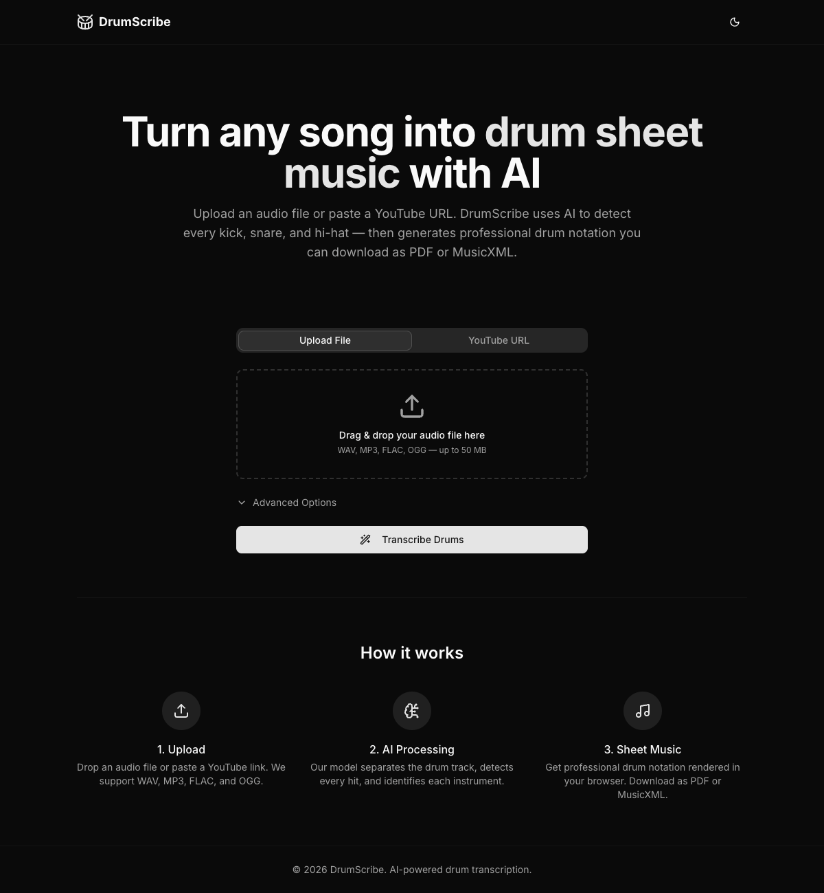
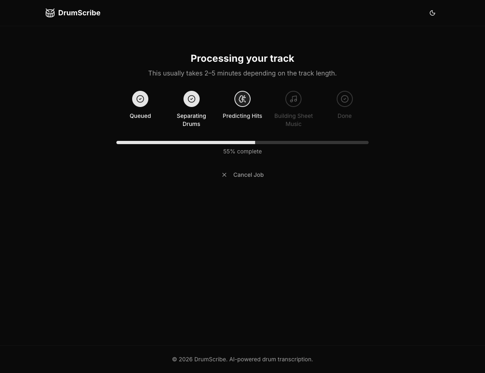
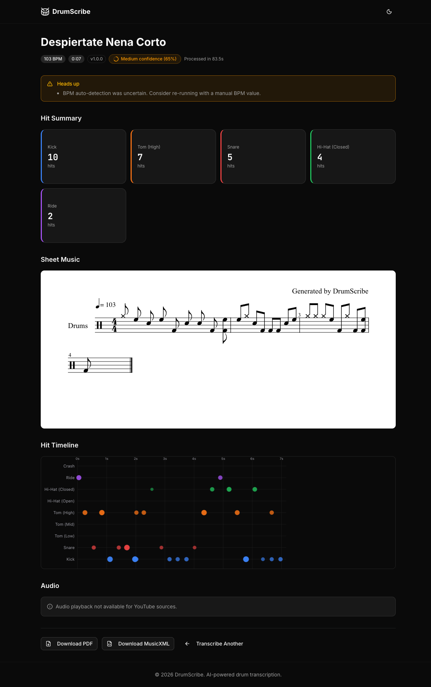
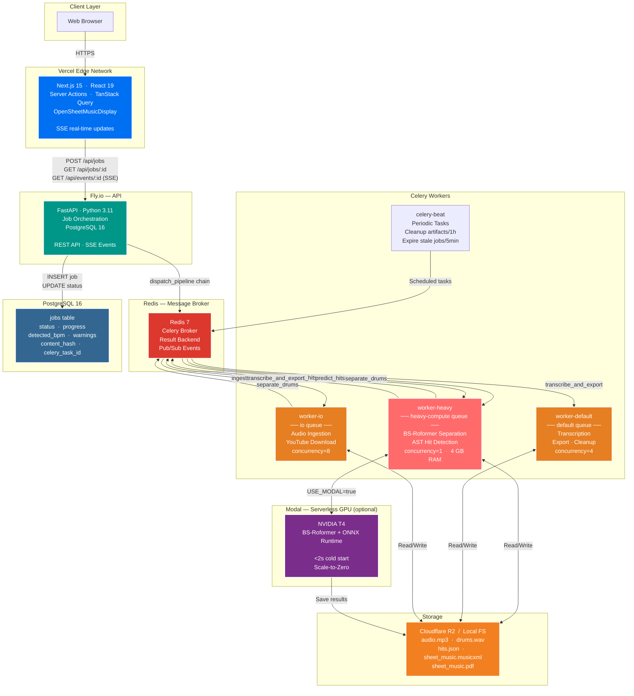
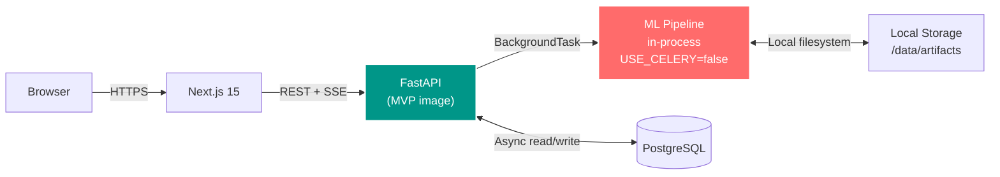
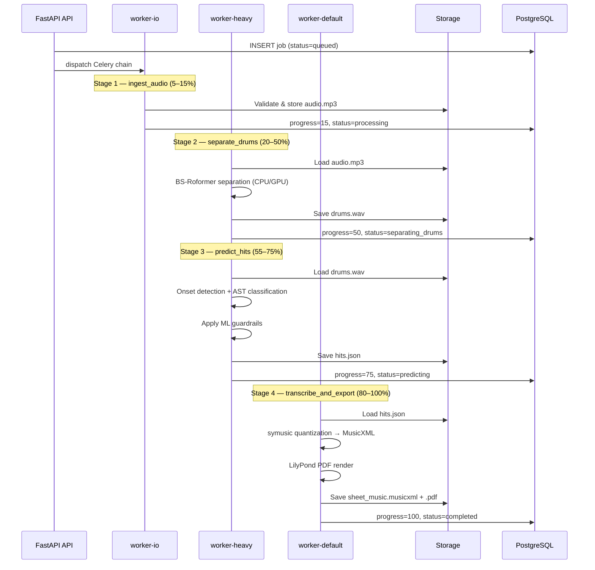
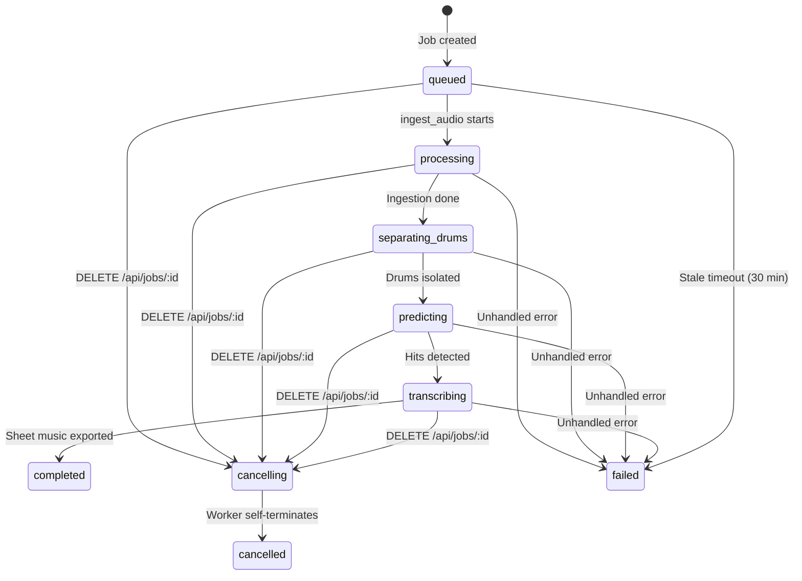

# DrumScribe

**AI-Powered Automatic Drum Transcription** — Upload audio or paste a YouTube URL, get professional drum sheet music in seconds.

<div align="center">

### Upload → AI Processing → Sheet Music

<table>
  <tr>
    <td width="33%" align="center">
      
      <br/><b>1. Upload Audio</b>
    </td>
    <td width="33%" align="center">
      
      <br/><b>2. AI Processing</b>
    </td>
    <td width="33%" align="center">
      
      <br/><b>3. Get Sheet Music</b>
    </td>
  </tr>
</table>

</div>

---

## System Architecture

DrumScribe ships in **two modes** that share the same codebase:

| Mode | When to use | Compose file |
|------|-------------|--------------|
| **MVP** | Local dev, demos, single-machine deploy | `docker-compose.mvp.yml` |
| **Full Stack** | Production, high throughput, horizontal scale | `docker-compose.yml` |

### Full Stack Architecture

The production system uses a **Celery task queue** to fan out the ML pipeline across three specialized worker tiers. Each tier scales independently; the heavy-compute tier can be swapped for Modal serverless GPUs.


```mermaid
graph TB
    subgraph Client["Client Layer"]
        Browser["Web Browser"]
    end

    subgraph Vercel["Vercel Edge Network"]
        NextJS["Next.js 15  ·  React 19\nServer Actions  ·  TanStack Query\nOpenSheetMusicDisplay\n\nSSE real-time updates"]
    end

    subgraph FlyIO["Fly.io — API"]
        FastAPI["FastAPI  ·  Python 3.11\nJob Orchestration\nPostgreSQL 16\n\nREST API  ·  SSE Events"]
    end

    subgraph Broker["Redis — Message Broker"]
        Redis["Redis 7\nCelery Broker\nResult Backend\nPub/Sub Events"]
    end

    subgraph Workers["Celery Workers"]
        WorkerIO["worker-io\n── io queue ──\nAudio Ingestion\nYouTube Download\nconcurrency=8"]
        WorkerDefault["worker-default\n── default queue ──\nTranscription\nExport  ·  Cleanup\nconcurrency=4"]
        WorkerHeavy["worker-heavy\n── heavy-compute queue ──\nBS-Roformer Separation\nAST Hit Detection\nconcurrency=1  ·  4 GB RAM"]
        Beat["celery-beat\nPeriodic Tasks\nCleanup artifacts/1h\nExpire stale jobs/5min"]
    end

    subgraph Compute["Modal — Serverless GPU (optional)"]
        GPU["NVIDIA T4\nBS-Roformer + ONNX Runtime\n\n<2s cold start\nScale-to-Zero"]
    end

    subgraph Storage["Storage"]
        R2["Cloudflare R2  /  Local FS\naudio.mp3  ·  drums.wav\nhits.json  ·  sheet_music.musicxml\nsheet_music.pdf"]
    end

    subgraph DB["PostgreSQL 16"]
        PG["jobs table\nstatus  ·  progress\ndetected_bpm  ·  warnings\ncontent_hash  ·  celery_task_id"]
    end

    Browser -->|HTTPS| NextJS
    NextJS -->|"POST /api/jobs\nGET /api/jobs/:id\nGET /api/events/:id (SSE)"| FastAPI
    FastAPI -->|"INSERT job\nUPDATE status"| PG
    FastAPI -->|"dispatch_pipeline chain"| Redis
    Redis -->|ingest_audio| WorkerIO
    WorkerIO -->|separate_drums| Redis
    Redis -->|separate_drums| WorkerHeavy
    WorkerHeavy -->|predict_hits| Redis
    Redis -->|predict_hits| WorkerHeavy
    WorkerHeavy -->|transcribe_and_export| Redis
    Redis -->|transcribe_and_export| WorkerDefault
    WorkerHeavy <-->|"USE_MODAL=true"| GPU
    WorkerHeavy <-->|"Read/Write"| R2
    WorkerDefault <-->|"Read/Write"| R2
    WorkerIO <-->|"Read/Write"| R2
    GPU -->|"Save results"| R2
    Beat -->|"Scheduled tasks"| Redis

    style NextJS fill:#0070f3,stroke:#fff,stroke-width:2px,color:#fff
    style FastAPI fill:#009688,stroke:#fff,stroke-width:2px,color:#fff
    style Redis fill:#dc382d,stroke:#fff,stroke-width:2px,color:#fff
    style WorkerHeavy fill:#ff6b6b,stroke:#fff,stroke-width:2px,color:#fff
    style WorkerIO fill:#e67e22,stroke:#fff,stroke-width:2px,color:#fff
    style WorkerDefault fill:#e67e22,stroke:#fff,stroke-width:2px,color:#fff
    style GPU fill:#7b2d8b,stroke:#fff,stroke-width:2px,color:#fff
    style R2 fill:#f38020,stroke:#fff,stroke-width:2px,color:#fff
    style PG fill:#336791,stroke:#fff,stroke-width:2px,color:#fff
```

### MVP Architecture (local development)

The MVP image runs the entire ML pipeline inside the FastAPI process as a `BackgroundTask` — no Redis or Celery required.


```mermaid
graph LR
    Browser["Browser"] -->|HTTPS| NextJS["Next.js 15"]
    NextJS -->|"REST + SSE"| FastAPI["FastAPI\n(MVP image)"]
    FastAPI -->|"BackgroundTask"| Pipeline["ML Pipeline\nin-process\nUSE_CELERY=false"]
    FastAPI <-->|"Async read/write"| PG[("PostgreSQL")]
    Pipeline <-->|"Local filesystem"| FS["Local Storage\n/data/artifacts"]

    style FastAPI fill:#009688,stroke:#fff,stroke-width:2px,color:#fff
    style Pipeline fill:#ff6b6b,stroke:#fff,stroke-width:2px,color:#fff
```

---

## ML Pipeline — 4 Stages


```mermaid
sequenceDiagram
    participant API as FastAPI API
    participant IO as worker-io
    participant Heavy as worker-heavy
    participant Def as worker-default
    participant R2 as Storage
    participant DB as PostgreSQL

    API->>DB: INSERT job (status=queued)
    API->>IO: dispatch Celery chain

    Note over IO: Stage 1 — ingest_audio (5–15%)
    IO->>R2: Validate & store audio.mp3
    IO->>DB: progress=15, status=processing

    Note over Heavy: Stage 2 — separate_drums (20–50%)
    Heavy->>R2: Load audio.mp3
    Heavy->>Heavy: BS-Roformer separation (CPU/GPU)
    Heavy->>R2: Save drums.wav
    Heavy->>DB: progress=50, status=separating_drums

    Note over Heavy: Stage 3 — predict_hits (55–75%)
    Heavy->>R2: Load drums.wav
    Heavy->>Heavy: Onset detection + AST classification
    Heavy->>Heavy: Apply ML guardrails
    Heavy->>R2: Save hits.json
    Heavy->>DB: progress=75, status=predicting

    Note over Def: Stage 4 — transcribe_and_export (80–100%)
    Def->>R2: Load hits.json
    Def->>Def: symusic quantization → MusicXML
    Def->>Def: LilyPond PDF render
    Def->>R2: Save sheet_music.musicxml + .pdf
    Def->>DB: progress=100, status=completed
```

### Job Status Lifecycle


```mermaid
stateDiagram-v2
    [*] --> queued: Job created
    queued --> processing: ingest_audio starts
    processing --> separating_drums: Ingestion done
    separating_drums --> predicting: Drums isolated
    predicting --> transcribing: Hits detected
    transcribing --> completed: Sheet music exported
    
    queued --> cancelling: DELETE /api/jobs/:id
    processing --> cancelling: DELETE /api/jobs/:id
    separating_drums --> cancelling: DELETE /api/jobs/:id
    predicting --> cancelling: DELETE /api/jobs/:id
    transcribing --> cancelling: DELETE /api/jobs/:id
    cancelling --> cancelled: Worker self-terminates

    processing --> failed: Unhandled error
    separating_drums --> failed: Unhandled error
    predicting --> failed: Unhandled error
    transcribing --> failed: Unhandled error
    queued --> failed: Stale timeout (30 min)
```

---

## Tech Stack

| Layer | Technology | Notes |
|-------|-----------|-------|
| **Frontend** | Next.js 15, React 19, TypeScript | Server Actions, TanStack Query, SSE polling |
| **Sheet Music** | OpenSheetMusicDisplay | MusicXML rendering, zoom, PDF export |
| **API** | FastAPI, SQLAlchemy (async), Pydantic v2 | `/api/jobs`, `/api/events/:id` SSE stream |
| **Task Queue** | Celery + Redis | 3 specialized queues; Celery Beat for periodic tasks |
| **Drum Separation** | BS-Roformer via `audio-separator[cpu]` | State-of-the-art transformer source separation |
| **Hit Detection** | AST → ONNX Runtime | Audio Spectrogram Transformer, 2.7x faster than eager PyTorch |
| **Symbolic Music** | symusic (C++ backend) | 10-100x faster than music21, 16th-note quantization |
| **PDF Export** | LilyPond | Server-side sheet music rendering |
| **Storage** | Cloudflare R2 / Local FS | S3-compatible; zero egress fees on R2 |
| **Database** | PostgreSQL 16 | Job state, content hash deduplication |
| **Observability** | Prometheus + OpenTelemetry + Jaeger | Structured JSON logs (structlog), Celery instrumentation |
| **Serverless GPU** | Modal (optional) | NVIDIA T4, scale-to-zero; enabled via `USE_MODAL=true` |

---

## Engineering Highlights

### Celery Queue Design

Three queues with separate worker pools prevent resource contention:

```
io              → concurrency=8,  memory=512MB  (fast I/O, YouTube downloads)
heavy-compute   → concurrency=1,  memory=4GB    (BS-Roformer, AST inference)
default         → concurrency=4,  memory=1GB    (quantization, LilyPond export)
```

Tasks form a **Celery chain** that passes `job_id` between stages. Each stage reads `status=cancelling` from the DB and self-terminates — no hard `SIGKILL`.

### Idempotency (150x Faster Retries)

Two layers of deduplication:

1. **Upload dedup** — SHA-256 hash stored in `jobs.content_hash`. Duplicate uploads within the same session return the existing in-flight job immediately.
2. **Prediction cache** — `predict_hits` skips expensive GPU inference if `hits.json` already exists and passes Pydantic validation. Retry cost: `0.1s` vs `15s+`.

### ML Guardrails (Pydantic Data Contracts)

```python
class DrumHit(BaseModel):
    time: float = Field(ge=0.0)
    instrument: str = Field(pattern="^(kick|snare|hihat_closed|...)$")
    velocity: float = Field(ge=0.0, le=1.0)
    model_config = {"frozen": True}
```

Three runtime guardrails prevent garbage sheet music:

- **BPM sanity** — halves BPM > 200 (catches 16th-note counting errors)
- **Polyphony limit** — max 4 simultaneous hits per 10ms (physical constraint)
- **Confidence filter** — drops hits with velocity < 0.15 (eliminates ghost noise)

### CPU-Only Docker Images

All Docker images install PyTorch from the CPU-only index to avoid pulling the 2–4 GB CUDA stack on non-GPU hosts:

```dockerfile
RUN pip install --index-url https://download.pytorch.org/whl/cpu \
    "torch>=2.0.0,<3.0.0" "torchaudio>=2.0.0"
```

Modal serverless functions get a separate GPU-enabled image built at deploy time.

### Cost Efficiency (Scale-to-Zero)

| Deployment | Monthly cost (1 000 tracks) | Savings |
|------------|----------------------------|---------|
| Always-on GPU (AWS g4dn.xlarge) | $432/month | Baseline |
| Modal Serverless | $35–55/month | **87–92%** |
| Cloudflare R2 vs S3 (egress) | $0.08 vs $1.03/month | **92%** |

---

## Quick Start

### Prerequisites

- Docker & Docker Compose
- Node.js 18+ (frontend development)
- Python 3.11+ (backend development)

### MVP Mode — Simplest Setup

No Redis, no Celery. The entire ML pipeline runs inside the API process.

```bash
# 1. Clone and configure
git clone https://github.com/your-org/drumscribe.git
cd drumscribe
cp .env.example .env

# 2. Start MVP stack (API + Frontend + PostgreSQL only)
docker compose -f docker-compose.mvp.yml up -d

# 3. Access
open http://localhost:3000       # Frontend
open http://localhost:8000/docs  # API docs
```

> **First run:** The MVP image downloads ML models (~700 MB) on startup. Health check has a 120s grace period.

### Full Stack — Production Mode

All Celery workers, Redis, Celery Beat, and optional Jaeger tracing.

```bash
# Start full stack
docker compose up -d

# With distributed tracing UI
docker compose --profile observability up -d

# Scale the heavy worker (e.g., 2 instances)
docker compose up -d --scale worker-heavy=2
```

**Services:**

| Service | URL |
|---------|-----|
| Frontend | http://localhost:3000 |
| API | http://localhost:8000 |
| API docs | http://localhost:8000/docs |
| API health | http://localhost:8000/api/health |
| Jaeger UI | http://localhost:16686 (with `--profile observability`) |

### Production Deployment

See **[docs/DEPLOYMENT.md](docs/DEPLOYMENT.md)** for the complete guide:
- Vercel (Frontend)
- Fly.io (API + PostgreSQL)
- Redis Cloud or Upstash (Celery broker)
- Modal (Serverless GPU)
- Cloudflare R2 (Storage)

---

## API Reference

| Method | Endpoint | Description |
|--------|----------|-------------|
| `POST` | `/api/jobs` | Create job — multipart file **or** `youtube_url` form field |
| `GET` | `/api/jobs/{id}` | Poll status, progress (0–100%), warnings |
| `GET` | `/api/jobs/{id}/result` | Hits, BPM, confidence, download URLs |
| `GET` | `/api/jobs/{id}/download/musicxml` | Stream MusicXML file |
| `GET` | `/api/jobs/{id}/download/pdf` | Stream PDF file |
| `DELETE` | `/api/jobs/{id}` | Cancel in-flight job or delete completed artifacts |
| `GET` | `/api/events/{id}` | SSE stream of real-time status events |
| `GET` | `/api/health` | Database, storage, and model health |

**Optional job creation fields:**

| Field | Type | Description |
|-------|------|-------------|
| `youtube_url` | string | YouTube URL (alternative to file upload) |
| `bpm` | int | Override detected BPM (40–300) |
| `webhook_url` | string | POST callback when job completes |
| `title` | string | Sheet music title (auto-derived from filename) |

Full docs: [docs/API_REFERENCE.md](docs/API_REFERENCE.md)

---

## Project Structure

```
drumscribe/
├── frontend/                        # Next.js 15 application
│   └── src/
│       ├── app/
│       │   ├── actions/jobs.ts      # Server Actions (job creation)
│       │   └── jobs/[id]/page.tsx   # Job status & results page
│       ├── components/              # upload/, processing/, result/, ui/
│       └── hooks/                   # useJobPolling, useUpload, useAudioPlayer
│
├── backend/
│   ├── app/
│   │   ├── api/v1/routes/
│   │   │   ├── jobs.py              # REST endpoints + MVP pipeline dispatch
│   │   │   ├── events.py            # SSE real-time event stream
│   │   │   └── health.py            # Health check
│   │   ├── ml/
│   │   │   ├── engine.py            # BS-Roformer + ONNX inference
│   │   │   ├── guardrails.py        # BPM/polyphony/confidence guardrails
│   │   │   ├── modal_client.py      # Modal serverless GPU client
│   │   │   ├── onset_detection.py   # Spectral flux onset detection
│   │   │   └── registry.py          # Model preloading registry
│   │   ├── services/
│   │   │   ├── transcription.py     # symusic quantization → MusicXML
│   │   │   ├── export.py            # LilyPond PDF export
│   │   │   ├── audio_ingestion.py   # Validation + YouTube download
│   │   │   └── webhook.py           # Job completion callbacks
│   │   ├── schemas/
│   │   │   ├── job.py               # API request/response schemas
│   │   │   └── ml_contracts.py      # Pydantic ML output contracts
│   │   ├── core/
│   │   │   ├── config.py            # Settings (env vars)
│   │   │   ├── telemetry.py         # Prometheus metrics + OTEL
│   │   │   └── events.py            # Redis/asyncio event bus
│   │   └── worker.py                # Celery app + all 4 pipeline tasks
│   │
│   ├── infrastructure/
│   │   ├── Dockerfile.api           # Lightweight API image
│   │   ├── Dockerfile.worker        # Worker image (CPU torch, LilyPond)
│   │   ├── Dockerfile.mvp           # All-in-one MVP image
│   │   └── modal_app.py             # Modal serverless GPU definition
│   │
│   ├── scripts/
│   │   └── export_ast_to_onnx.py    # Compile AST → ONNX (2.7x speedup)
│   │
│   └── tests/
│       ├── unit/                    # Guardrails, contracts, onset detection
│       ├── integration/             # API endpoint tests
│       └── regression/              # Golden file tests
│
├── docs/
│   ├── ARCHITECTURE.md              # Deep-dive system design
│   ├── ML_PIPELINE.md               # torchaudio → BS-Roformer → ONNX → symusic
│   ├── MODAL_DEPLOYMENT.md          # Serverless GPU setup
│   ├── DEPLOYMENT.md                # Full production deployment guide
│   └── API_REFERENCE.md             # Complete REST API reference
│
├── docker-compose.yml               # Full stack (Celery + Redis + workers)
├── docker-compose.mvp.yml           # MVP stack (no Celery, no Redis)
└── docker-compose.override.yml      # Local dev overrides
```

---

## Configuration

All settings via `.env` (see [`.env.example`](.env.example)):

### Deployment Mode

| Variable | Default | Description |
|----------|---------|-------------|
| `USE_CELERY` | `true` | `false` → run pipeline in FastAPI BackgroundTask (MVP) |
| `USE_MODAL` | `false` | `true` → heavy-compute tasks run on Modal serverless GPU |

### Storage

| Variable | Default | Description |
|----------|---------|-------------|
| `STORAGE_BACKEND` | `local` | `local` or `s3` (Cloudflare R2 or any S3) |
| `S3_BUCKET` | — | R2 bucket name |
| `S3_ENDPOINT_URL` | — | R2 endpoint (`https://<id>.r2.cloudflarestorage.com`) |
| `ARTIFACTS_DIR` | `/data/artifacts` | Local storage root |

### ML Pipeline

| Variable | Default | Description |
|----------|---------|-------------|
| `ONSET_SENSITIVITY` | `0.05` | Spectral flux threshold (lower = more sensitive) |
| `LOW_CONFIDENCE_THRESHOLD` | `0.5` | Confidence below which a warning is attached |
| `PDF_BACKEND` | `lilypond` | `lilypond` or `none` |

### Limits & Cleanup

| Variable | Default | Description |
|----------|---------|-------------|
| `MAX_FILE_SIZE_MB` | `50` | Upload size limit |
| `ARTIFACT_TTL_HOURS` | `24` | Artifacts deleted by Celery Beat after this many hours |
| `MAX_CONCURRENT_JOBS_PER_USER` | `3` | Per-IP concurrency cap (429 if exceeded) |

### Modal Serverless GPU

| Variable | Default | Description |
|----------|---------|-------------|
| `MODAL_APP_NAME` | `drumscribe-ml` | Modal app name |
| `MODAL_FUNCTION_NAME` | `process_audio_pipeline` | Modal function name |

---

## Testing

```bash
# Unit tests (guardrails, Pydantic contracts, onset detection)
cd backend && pytest tests/unit/

# Integration tests (API endpoints, DB)
pytest tests/integration/

# Regression / golden file tests
pytest tests/regression/

# All tests
pytest

# Frontend
cd frontend && npm test
```

---

## Monitoring & Observability

- **Structured logs** — JSON via `structlog`, every task logs `job_id` + elapsed ms
- **Prometheus metrics** — `INFERENCE_LATENCY`, `JOBS_TOTAL`, `ACTIVE_JOBS_GAUGE`, `AUDIO_DURATION_PROCESSED`
- **OpenTelemetry tracing** — Celery tasks auto-instrumented; export to Jaeger (`--profile observability`)
- **Health endpoint** — `GET /api/health` checks DB, storage, and model registry
- **Stale job expiry** — Celery Beat marks jobs stuck in active states > 30 min as `failed`

---

## Documentation

| Guide | Description |
|-------|-------------|
| [System Architecture](docs/ARCHITECTURE.md) | Decoupled serverless design, data flow, security |
| [ML Pipeline](docs/ML_PIPELINE.md) | torchaudio → BS-Roformer → ONNX → symusic deep dive |
| [Modal Deployment](docs/MODAL_DEPLOYMENT.md) | Serverless GPU configuration and cold-start optimization |
| [Production Deployment](docs/DEPLOYMENT.md) | Vercel, Fly.io, Modal, R2 step-by-step |
| [API Reference](docs/API_REFERENCE.md) | Complete REST API documentation |
| [Frontend Guide](frontend/README.md) | Next.js development setup |
| [Backend Guide](backend/README.md) | FastAPI + Celery development setup |
| [ONNX Export](backend/scripts/README.md) | How to recompile AST to ONNX |

---

## Contributing

1. Fork the repository
2. Create a feature branch (`git checkout -b feature/amazing-feature`)
3. Run tests (`cd backend && pytest`)
4. Commit (`git commit -m 'Add amazing feature'`)
5. Open a Pull Request

---

## License

MIT License — see [LICENSE](LICENSE) file for details.

---

## Acknowledgments

- **BS-Roformer** — state-of-the-art music source separation
- **Audio Spectrogram Transformer (AST)** — MIT / HuggingFace
- **audio-separator** — BS-Roformer inference wrapper
- **symusic** — C++-backed symbolic music processing
- **LilyPond** — professional music engraving
- **Modal** — serverless GPU infrastructure
- **OpenSheetMusicDisplay** — interactive MusicXML rendering

---

<div align="center">

**Built with love by the DrumScribe Team**

[Website](https://drumscribe.ai) • [Documentation](docs/) • [API Docs](https://api.drumscribe.ai/docs)

</div>
