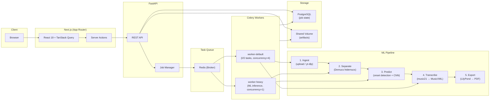

# DrumScribe

**Automatic drum transcription** — upload an audio file or paste a YouTube link, get drum sheet music (MusicXML + PDF).

A full-stack ML application that isolates drums from a mix using source separation, classifies individual hits with a CNN, and quantizes the output to standard music notation.

## System Architecture


```mermaid
flowchart LR
    subgraph Client
        Browser["Browser"]
    end

    subgraph Frontend["Next.js (App Router)"]
        SSR["Server Actions"]
        UI["React 19 + TanStack Query"]
    end

    subgraph API["FastAPI"]
        REST["REST API"]
        Jobs["Job Manager"]
    end

    subgraph Queue["Task Queue"]
        Redis["Redis (Broker)"]
    end

    subgraph Workers["Celery Workers"]
        direction TB
        WD["worker-default\n(I/O tasks, concurrency=4)"]
        WH["worker-heavy\n(ML inference, concurrency=1)"]
    end

    subgraph ML["ML Pipeline"]
        direction TB
        Ingest["1. Ingest\n(upload / yt-dlp)"]
        Separate["2. Separate\n(Demucs htdemucs)"]
        Predict["3. Predict\n(onset detection + CNN)"]
        Transcribe["4. Transcribe\n(music21 → MusicXML)"]
        Export["5. Export\n(LilyPond → PDF)"]
        Ingest --> Separate --> Predict --> Transcribe --> Export
    end

    subgraph Storage
        PG["PostgreSQL\n(job state)"]
        Vol["Shared Volume\n(artifacts)"]
    end

    Browser --> UI --> SSR --> REST
    REST --> Jobs --> Redis
    Redis --> WD --> Ingest
    Redis --> WH --> Separate
    WH --> Predict
    WD --> Transcribe
    Workers --> PG
    Workers --> Vol
    REST --> PG
    REST --> Vol
```

## Tech Stack

| Layer | Technology | Why |
|-------|-----------|-----|
| **API** | FastAPI (Python 3.11) | Async I/O for concurrent job polling; auto-generated OpenAPI docs; Pydantic validation |
| **Task Queue** | Celery + Redis | Decoupled worker pools — I/O-bound tasks (ingest, export) run at high concurrency while memory-intensive ML tasks (Demucs at ~3 GB RSS, CNN inference) run at `concurrency=1` with `max-memory-per-child` recycling |
| **Frontend** | Next.js 16, React 19, TypeScript | Server Actions for secure job creation (BFF pattern); TanStack Query for polling; OpenSheetMusicDisplay for in-browser MusicXML rendering |
| **ML** | Demucs (source separation), Keras CNN (hit classification), madmom + librosa (BPM detection), music21 (notation) | Replicates [AnNOTEator](https://github.com/cb-42/AnNOTEator)'s research pipeline, adapted for production with singleton model loading, atomic file writes, and structured error propagation |
| **Observability** | Prometheus, OpenTelemetry, Jaeger, structlog | Distributed tracing across API → Celery chain; JSON-structured logs; per-task latency histograms |
| **Infrastructure** | Docker Compose, GitHub Actions | Multi-stage builds with SHA-pinned base images; Trivy CVE scanning; YAML anchors for DRY config; read-only containers with `cap_drop: ALL` |

## Engineering Highlights

- **Decoupled worker pools** — `worker-default` (4 concurrent, 512 MB limit) handles I/O tasks; `worker-heavy` (1 concurrent, 4 GB limit) handles Demucs source separation and CNN inference. This prevents OOM kills from blocking the entire pipeline.
- **ML model lifecycle** — Workers auto-download model weights from HTTP/S3 on first start, with SHA256 integrity verification and version-triggered cache invalidation. No model files in the repo.
- **Atomic artifact writes** — All file outputs use `tempfile` → `os.replace()` to prevent corrupt artifacts on worker crash or OOM kill mid-write.
- **Security hardening** — All containers run as non-root (UID 1001), read-only filesystems, `cap_drop: ALL`, `no-new-privileges`, resource limits on every service.
- **BFF pattern** — Frontend uses `API_URL` (internal Docker network) for server-side requests and `NEXT_PUBLIC_API_URL` (public) for client-side, avoiding CORS complexity.

## Quick Start

### Using Makefile (Recommended)

```bash
# First time setup - validates environment and starts services
make init

# Start services (defaults to MVP mode)
make up

# Start full production stack
make up MODE=full

# Check system health
make health

# View logs
make logs SERVICE=api

# Stop services
make down
```

### Manual Setup

```bash
cp .env.example .env
docker compose -f docker-compose.mvp.yml up -d
```

| Service | URL |
|---------|-----|
| Frontend | [localhost:3000](http://localhost:3000) |
| API Docs | [localhost:8000/docs](http://localhost:8000/docs) |
| API Health | [localhost:8000/api/health](http://localhost:8000/api/health) |
| Metrics | [localhost:8000/metrics](http://localhost:8000/metrics) |

**Available Makefile commands:** Run `make` or `make help` to see all available commands.

**Key commands:**
- `make up [MODE=mvp|full]` - Start services (default: mvp)
- `make build` - Build images without starting
- `make rebuild` - Rebuild images and restart
- `make logs [SERVICE=api|frontend|postgres]` - View logs
- `make logs JOB=<id>` - Filter logs by job ID
- `make shell [SERVICE=api|db]` - Open interactive shell
- `make down` - Stop containers
- `make clean` - Remove containers and volumes

## Monitoring & Debugging

### Viewing Logs

```bash
# Watch API logs in real-time (shows job progress)
make logs SERVICE=api

# Filter logs for a specific job
make logs JOB=5eff57ed-1829-4af0-9f67-66cbaea82910

# View all container logs
make logs

# View specific service logs
make logs SERVICE=frontend
make logs SERVICE=postgres
```

### Understanding Job Progress

When processing audio, you'll see clear stage indicators in the logs:

- 🚀 **PIPELINE START** - Job created and queued
- 📥 **[1/4] INGESTING AUDIO** (5%) - Validating file (~1-2s)
- 🥁 **[2/4] SEPARATING DRUMS** (20-50%) - AI drum isolation (~10-30s, longest stage)
- 🎯 **[3/4] DETECTING HITS** (55-75%) - CNN detecting patterns (~5-15s)
- 📝 **[4/4] GENERATING SHEET MUSIC** (80-100%) - Creating notation (~5-10s)
- ✅ **PIPELINE COMPLETE** (100%) - Done!

See **[`docs/LOGGING_GUIDE.md`](docs/LOGGING_GUIDE.md)** for detailed logging documentation and troubleshooting.

### Log Configuration

Adjust log verbosity in `.env`:

```bash
LOG_LEVEL=INFO        # Default: balanced output
LOG_LEVEL=DEBUG       # Verbose: includes memory usage
LOG_LEVEL=WARNING     # Quiet: only warnings and errors
ENVIRONMENT=development  # Human-readable logs with colors
ENVIRONMENT=production   # JSON structured logs
```

## API

| Method | Endpoint | Description |
|--------|----------|-------------|
| `POST` | `/api/jobs` | Create transcription job (file upload or YouTube URL) |
| `GET` | `/api/jobs/{id}` | Poll job status + progress |
| `GET` | `/api/jobs/{id}/result` | Result payload (hits, BPM, confidence) |
| `GET` | `/api/jobs/{id}/download/{fmt}` | Download `musicxml` or `pdf` |
| `DELETE` | `/api/jobs/{id}` | Cancel / delete job |
| `GET` | `/api/health` | Health check (DB, Redis, model status) |

## Project Structure

```
backend/
  app/
    api/v1/routes/        REST endpoints (jobs, health)
    ml/
      engine.py           Demucs separation + CNN prediction pipeline
      registry.py         Model resolution, caching, remote download
    services/             Transcription, export, audio ingestion, webhooks
    storage/              Storage abstraction (local volume / S3)
    core/                 Config, database, security, telemetry
    models/               SQLAlchemy models
    schemas/              Pydantic request/response schemas
    worker.py             Celery app, task definitions, pipeline chain
  infrastructure/         Dockerfiles (API, Worker)
  scripts/                Model download, worker entrypoint, seed data
  tests/                  Unit + integration tests
frontend/
  src/
    app/                  Next.js App Router (pages, server actions)
    components/           Upload, processing, result, layout, UI primitives
    hooks/                Job polling, upload progress, audio player
    lib/                  API client, utilities
docker-compose.yml        Production (8 services + optional Jaeger)
docker-compose.mvp.yml    MVP mode (Frontend + API + Postgres only)
docker-compose.override.yml  Dev overrides (hot-reload, relaxed limits)
scripts/                  Orchestration scripts (init, health-check)
docs/                     DEVOPS.md, ML_PIPELINE.md, MVP_MODE.md
```

## Documentation

- **[`docs/`](docs/)** — Complete documentation index
  - **[`DEVOPS.md`](docs/DEVOPS.md)** — Operational manual: scaling, OOM analysis, model pre-seeding, disaster recovery
  - **[`ML_PIPELINE.md`](docs/ML_PIPELINE.md)** — ML pipeline breakdown: Demucs config, CNN architecture, BPM detection strategy
  - **[`MVP_MODE.md`](docs/MVP_MODE.md)** — Simplified deployment without Celery/Redis
  - **[`LOGGING_GUIDE.md`](docs/LOGGING_GUIDE.md)** — Understanding logs, debugging jobs, monitoring pipeline progress
- **[`backend/README.md`](backend/README.md)** — Backend API reference and local development setup
- **[`frontend/README.md`](frontend/README.md)** — Frontend stack, component structure, testing
- **[`scripts/README.md`](scripts/README.md)** — Orchestration scripts, health checks, debugging tools
- **[`inference/README.md`](inference/README.md)** — Model setup and management

## Configuration

All configuration via root `.env` file (see [`.env.example`](.env.example)). Key variables:

| Variable | Default | Description |
|----------|---------|-------------|
| `USE_CELERY` | `true` | Set to `false` for MVP mode (no Redis/Celery) |
| `MODEL_URI` | local path | Keras weights — set to HTTP/S3 URL in production |
| `STORAGE_BACKEND` | `local` | `local` (Docker volume) or `s3` (PaaS-compatible) |
| `PDF_BACKEND` | `lilypond` | `lilypond` (headless), `musescore` (needs xvfb), or `none` |
| `MAX_FILE_SIZE_MB` | `50` | Upload size limit |
| `ARTIFACT_TTL_HOURS` | `24` | Auto-cleanup threshold for job artifacts |
| `LOG_LEVEL` | `INFO` | Logging verbosity: `DEBUG`, `INFO`, `WARNING`, `ERROR` |
| `ENVIRONMENT` | `development` | `development` (readable logs) or `production` (JSON) |

## Deployment Modes

**MVP Mode** (Recommended for getting started):
- Single container runs ML pipeline in-process
- No Celery/Redis required
- 4-8 GB RAM, suitable for 5-10 concurrent users
- Start with: `make init` or `make up`

**Production Mode** (For scale):
- Distributed workers with Celery + Redis
- Separate I/O and ML worker pools
- Horizontal scaling, observability with Jaeger
- Start with: `make up MODE=full`

See **[`docs/MVP_MODE.md`](docs/MVP_MODE.md)** for detailed comparison.

## License

MIT
