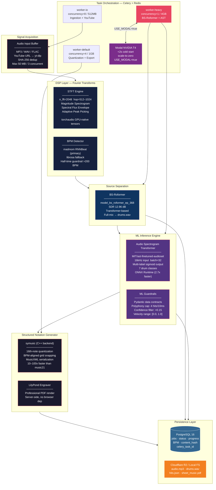
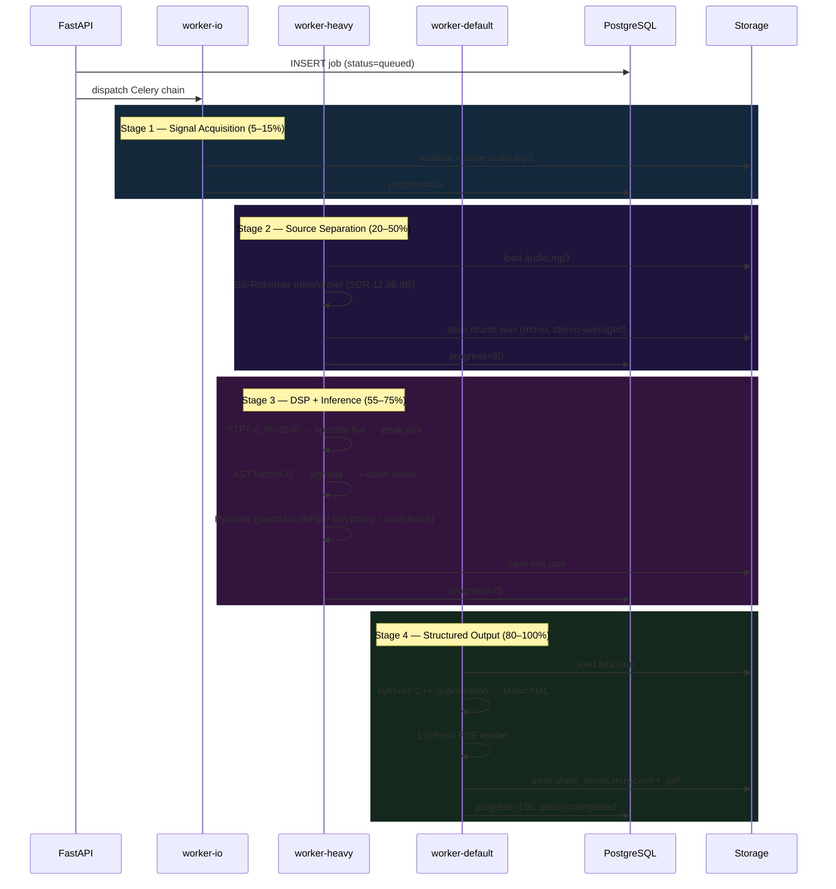
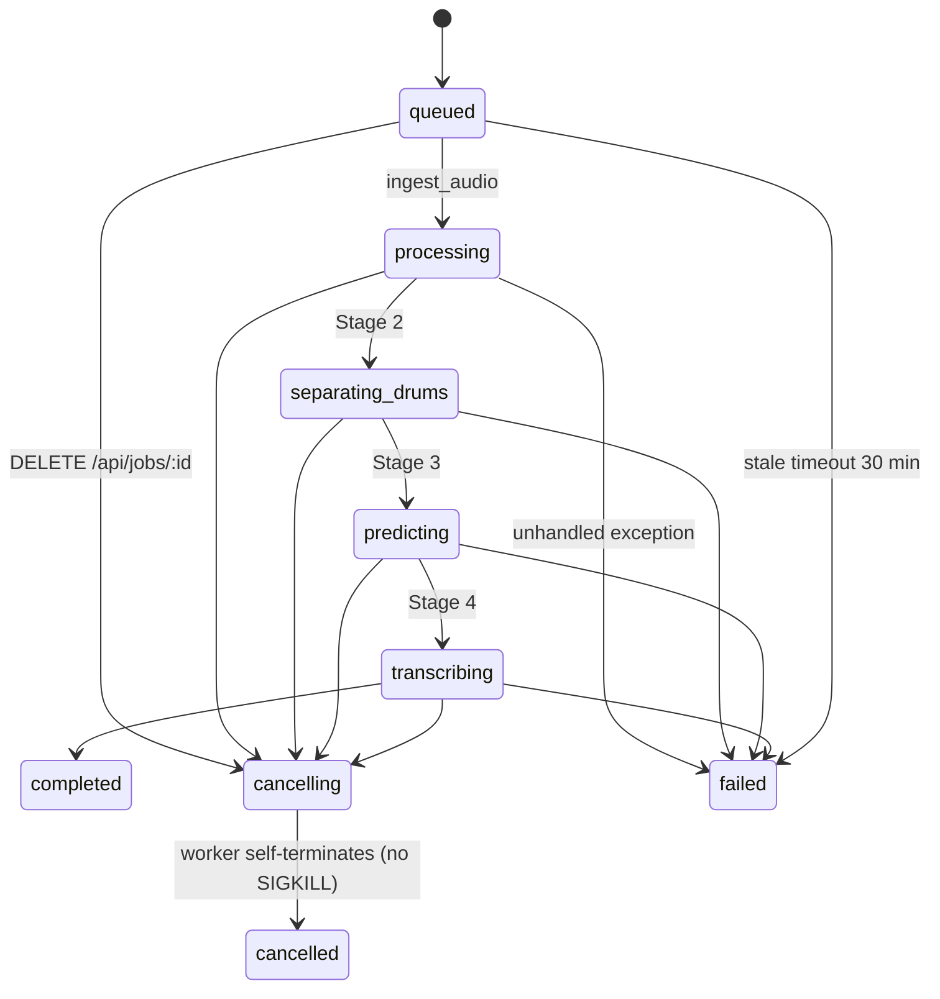

# CDrumscribe — Technical Specification & Infrastructure

> **Converting physical percussion into structured digital notation** — the hardest signal processing problem in music AI, solved end-to-end.

<div align="center">

| Signal Acquisition | DSP Layer | ML Inference | Structured Output |
|---|---|---|---|
| Audio Buffer / YouTube | STFT → Spectral Flux | BS-Roformer + AST | MusicXML / PDF |

</div>

---

## Executive Summary

Drum transcription is an unsolved physical-to-digital challenge: unlike pitched instruments, percussion produces broadband, transient, polyphonic signals with no harmonic content — standard onset detection fails, pitch-based models are blind, and the ground truth is a 2D notation system with strict temporal quantization constraints. CDrumscribe is a production-grade MLOps pipeline that solves this in four discrete, independently-scalable stages: source separation, onset detection, instrument classification, and symbolic music export.

---

## System Architecture

Two deployment modes share a single codebase. The production stack fans out inference across three specialized Celery worker tiers; each tier scales independently and the heavy-compute tier can be offloaded to Modal serverless GPUs with `USE_MODAL=true`.


```mermaid
flowchart TB
    subgraph Ingress["Signal Acquisition"]
        AB["Audio Input Buffer\n──────────────\nMP3 / WAV / FLAC\nYouTube URL → yt-dlp\nSHA-256 dedup\nMax 50 MB / 3 concurrent"]
    end

    subgraph DSP["DSP Layer — Fourier Transforms"]
        STFT["STFT Engine\n──────────────\nn_fft=2048  hop=512–1024\nMagnitude Spectrogram\nSpectral Flux Envelope\nAdaptive Peak Picking\n\ntorchaudio GPU-native tensors"]
        BPM["BPM Detector\n──────────────\nmadmom RNNBeat (primary)\nlibrosa fallback\nHalf-time guardrail >200 BPM"]
    end

    subgraph Sep["Source Separation"]
        BSR["BS-Roformer\n──────────────\nmodel_bs_roformer_ep_368\nSDR 12.96 dB\nTransformer-based\nFull-mix → drums.wav"]
    end

    subgraph Inference["ML Inference Engine"]
        AST["Audio Spectrogram Transformer\n──────────────\nMIT/ast-finetuned-audioset\n16kHz input  batch=32\nMulti-label sigmoid output\n7 drum classes\nONNX Runtime (2.7x faster)"]
        GR["ML Guardrails\n──────────────\nPydantic data contracts\nPolyphony cap: 4 hits/10ms\nConfidence filter: >0.15\nVelocity range: [0.0, 1.0]"]
    end

    subgraph Export["Structured Notation Generator"]
        SYM["symusic (C++ backend)\n──────────────\n16th-note quantization\nBPM-aligned grid snapping\nMusicXML serialization\n10–100x faster than music21"]
        LP["LilyPond Engraver\n──────────────\nProfessional PDF render\nServer-side, no browser dep"]
    end

    subgraph Orchestration["Task Orchestration — Celery + Redis"]
        WIO["worker-io\nconcurrency=8 / 512MB\nIngestion + YouTube"]
        WHV["worker-heavy\nconcurrency=1 / 4GB\nBS-Roformer + AST"]
        WDF["worker-default\nconcurrency=4 / 1GB\nQuantization + Export"]
        GPU["Modal NVIDIA T4\n<2s cold start\nscale-to-zero\nUSE_MODAL=true"]
    end

    subgraph Persistence["Persistence Layer"]
        PG[("PostgreSQL 16\njobs · status · progress\nBPM · content_hash\ncelery_task_id")]
        R2["Cloudflare R2 / Local FS\naudio.mp3 · drums.wav\nhits.json · sheet_music.pdf"]
    end

    AB --> DSP
    DSP --> Sep
    Sep --> Inference
    Inference --> Export

    WIO --> AB
    WHV --> Sep
    WHV --> Inference
    WDF --> Export
    WHV <-->|"USE_MODAL=true"| GPU

    Export --> Persistence
    Sep --> Persistence
    Inference --> Persistence

    style AB fill:#1a1a2e,stroke:#e94560,color:#fff
    style STFT fill:#16213e,stroke:#0f3460,color:#fff
    style BPM fill:#16213e,stroke:#0f3460,color:#fff
    style BSR fill:#0f3460,stroke:#533483,color:#fff
    style AST fill:#533483,stroke:#e94560,color:#fff
    style GR fill:#533483,stroke:#e94560,color:#fff
    style SYM fill:#1a1a2e,stroke:#e94560,color:#fff
    style LP fill:#1a1a2e,stroke:#e94560,color:#fff
    style WHV fill:#e94560,stroke:#fff,color:#fff
    style GPU fill:#7b2d8b,stroke:#fff,color:#fff
    style PG fill:#336791,stroke:#fff,color:#fff
    style R2 fill:#f38020,stroke:#fff,color:#fff
```

### Stage-by-Stage Pipeline Sequence


```mermaid
sequenceDiagram
    participant API as FastAPI
    participant IO  as worker-io
    participant HV  as worker-heavy
    participant DF  as worker-default
    participant DB  as PostgreSQL
    participant S3  as Storage

    API->>DB: INSERT job (status=queued)
    API->>IO: dispatch Celery chain

    rect rgb(20, 40, 60)
    Note over IO: Stage 1 — Signal Acquisition (5–15%)
    IO->>S3: validate + store audio.mp3
    IO->>DB: progress=15
    end

    rect rgb(30, 20, 60)
    Note over HV: Stage 2 — Source Separation (20–50%)
    HV->>S3: load audio.mp3
    HV->>HV: BS-Roformer transformer (SDR 12.96 dB)
    HV->>S3: save drums.wav (mono, stereo-averaged)
    HV->>DB: progress=50
    end

    rect rgb(50, 20, 60)
    Note over HV: Stage 3 — DSP + Inference (55–75%)
    HV->>HV: STFT n_fft=2048 → spectral flux → peak pick
    HV->>HV: AST batch=32 → sigmoid → 7-class labels
    HV->>HV: Pydantic guardrails (BPM / polyphony / confidence)
    HV->>S3: save hits.json
    HV->>DB: progress=75
    end

    rect rgb(20, 40, 30)
    Note over DF: Stage 4 — Structured Output (80–100%)
    DF->>S3: load hits.json
    DF->>DF: symusic C++ quantization → MusicXML
    DF->>DF: LilyPond PDF render
    DF->>S3: save sheet_music.musicxml + .pdf
    DF->>DB: progress=100, status=completed
    end
```

### Job Lifecycle


```mermaid
stateDiagram-v2
    [*] --> queued
    queued --> processing      : ingest_audio
    processing --> separating_drums : Stage 2
    separating_drums --> predicting : Stage 3
    predicting --> transcribing : Stage 4
    transcribing --> completed

    queued --> cancelling      : DELETE /api/jobs/:id
    processing --> cancelling
    separating_drums --> cancelling
    predicting --> cancelling
    transcribing --> cancelling
    cancelling --> cancelled   : worker self-terminates (no SIGKILL)

    processing --> failed      : unhandled exception
    separating_drums --> failed
    predicting --> failed
    transcribing --> failed
    queued --> failed          : stale timeout 30 min
```

---

## Architectural Choices

### DSP Layer — Why STFT over Mel-Spectrograms

The onset detector computes a raw **magnitude spectrogram** (not Mel-scaled) using `n_fft=2048` with `hop_length=512–1024` (adaptive: 512 at BPM > 110, 1024 otherwise). Mel-scaling is optimized for pitch perception; drum transients carry energy across the full spectral range. Spectral flux on a linear spectrogram captures the broadband energy burst of a drum hit without compressing the high-frequency transient content that distinguishes a snare from a hi-hat.

The entire DSP chain stays in **torchaudio tensor space** (`torchaudio.transforms.Spectrogram`) — no intermediate NumPy conversion until the final peak extraction loop. This keeps the path GPU-compatible and minimizes memory allocation overhead.

### Inference Engine — AST + ONNX

The Audio Spectrogram Transformer (`MIT/ast-finetuned-audioset-10-10-0.4593`) is a Vision Transformer adapted for audio. Each detected onset produces a fixed 8820-sample clip (resampled to 16kHz), batched at 32 clips per forward pass. The model outputs **multi-label sigmoid probabilities** across 527 AudioSet classes, which are post-processed through a deterministic `AUDIOSET_TO_DRUM_MAP` into 7 canonical drum classes.

For production, the AST weights are compiled to **ONNX Runtime** via `scripts/export_ast_to_onnx.py` — 2.7x faster than eager PyTorch on CPU, eliminating the transformer overhead on non-GPU workers.

### Symbolic Music — symusic C++ Backend

`symusic` replaces `music21` for the quantization and MusicXML serialization step. Its C++ core benchmarks **10–100x faster** than the Python equivalent, which matters at scale when the `worker-default` pool handles concurrent export jobs. 16th-note grid quantization is BPM-aligned: `grid_unit = 60 / bpm / 4` seconds.

---

## Bottlenecks & Latency Optimizations

| Bottleneck | Solution | Impact |
|---|---|---|
| Model cold-start (BS-Roformer ~700MB) | Singleton pattern + per-process lock | Load once, amortize across all jobs |
| AST eager PyTorch on CPU | ONNX Runtime export | **2.7x** inference speedup |
| Stereo→mono conversion | `tensor.mean(dim=0)` — stays in tensor space | Avoids NumPy round-trip per channel |
| Duplicate audio uploads | SHA-256 `content_hash` in DB | Returns existing job in `0ms` vs full pipeline |
| Retry after partial failure | `hits.json` existence + Pydantic validation check | `0.1s` vs `15s+` GPU inference re-run |
| Clip resampling (per-onset) | `torchaudio.transforms.Resample` (GPU-compatible) | Replaces per-clip `librosa.resample` call |
| Memory after inference | Explicit `del` + `gc.collect()` + `cuda.empty_cache()` | Keeps 4GB worker under peak RSS |
| CPU Docker image size | `--index-url https://download.pytorch.org/whl/cpu` | Strips 2–4GB CUDA stack from non-GPU images |

### Queue Design — Resource Isolation

Three Celery queues prevent resource contention. The heavy-compute worker runs `concurrency=1` by design — BS-Roformer is a transformer that saturates available RAM at a single instance. Parallelism here causes OOM, not speedup.

```
io              concurrency=8   512 MB   YouTube download, file validation
heavy-compute   concurrency=1   4 GB     BS-Roformer separation + AST inference
default         concurrency=4   1 GB     symusic quantization, LilyPond export
```

### Pydantic Data Contracts at the ML Boundary

```python
class DrumHit(BaseModel):
    time:       float = Field(ge=0.0)
    instrument: str   = Field(pattern="^(kick|snare|hihat_closed|...)$")
    velocity:   float = Field(ge=0.0, le=1.0)
    model_config = {"frozen": True}
```

Three runtime guardrails at the inference boundary:

- **BPM sanity** — halves BPM > 200 (catches 16th-note double-counting)
- **Polyphony cap** — max 4 simultaneous hits per 10ms window (physical constraint)
- **Confidence filter** — drops hits with `velocity < 0.15` (eliminates ghost-note noise)

The entire `PredictionResult` is validated via `model_validate()` before the result is written to storage — garbage-in/garbage-out is caught at the seam, not downstream.

---

## Built for Scale

The architecture is intentionally over-engineered for a one-user demo. That is the point.

Every design decision — queue isolation, Pydantic contracts at ML boundaries, ONNX compilation, scale-to-zero GPU, S3-compatible storage, OpenTelemetry tracing — reflects production constraints at 10,000 jobs/day, not 10. The serverless GPU tier costs **87–92% less** than always-on compute at 1,000 tracks/month ($35–55 vs $432 on AWS g4dn.xlarge). Cloudflare R2 reduces egress costs **92%** vs S3.

The same `worker-heavy` service that runs BS-Roformer locally is a `modal.Function` on a T4 GPU when `USE_MODAL=true` is flipped — zero code change, sub-2s cold start, scale-to-zero billing. The infra was designed so that the bottleneck is never the architecture.

---

## Tech Stack

| Layer | Technology | Decision Rationale |
|---|---|---|
| **Frontend** | Next.js 15, React 19, TypeScript | Server Actions + SSE for real-time progress |
| **Sheet Music Render** | OpenSheetMusicDisplay | Interactive MusicXML in-browser, no PDF dependency |
| **API** | FastAPI + SQLAlchemy async + Pydantic v2 | Async I/O for SSE streams; typed contracts throughout |
| **Task Queue** | Celery + Redis | 3-tier queue isolation; Celery Beat for stale job GC |
| **Drum Separation** | BS-Roformer via `audio-separator` | State-of-the-art SDR (12.96 dB), transformer architecture |
| **Onset Detection** | torchaudio STFT + spectral flux | GPU-native, no librosa dependency in hot path |
| **Hit Classification** | AST → ONNX Runtime | 527-class AudioSet → 7 drum classes; 2.7x CPU speedup |
| **Symbolic Music** | symusic (C++ backend) | 10–100x over music21; 16th-note BPM-aligned quantization |
| **PDF Export** | LilyPond | Professional music engraving, server-side |
| **Storage** | Cloudflare R2 / Local FS | S3-compatible; $0 egress |
| **Database** | PostgreSQL 16 | Job state machine; SHA-256 content dedup |
| **Observability** | Prometheus + OpenTelemetry + Jaeger | `INFERENCE_LATENCY`, `JOBS_TOTAL`, Celery auto-instrumentation |
| **Serverless GPU** | Modal (NVIDIA T4) | Scale-to-zero; `USE_MODAL=true` flag, no code change |

---

## Quick Start

### MVP Mode (no queue, no Redis)

```bash
git clone https://github.com/your-org/cdrumscribe.git && cd cdrumscribe
cp .env.example .env
docker compose -f docker-compose.mvp.yml up -d
# → http://localhost:3000  (frontend)
# → http://localhost:8000/docs  (API)
```

> First run downloads ML models (~700 MB). Health check has a 120s grace period.

### Full Production Stack

```bash
docker compose up -d                                  # all workers + Redis + Beat
docker compose --profile observability up -d          # + Jaeger tracing UI
docker compose up -d --scale worker-heavy=2           # horizontal GPU scale
```

| Service | URL |
|---|---|
| Frontend | http://localhost:3000 |
| API | http://localhost:8000 |
| API Docs | http://localhost:8000/docs |
| Jaeger UI | http://localhost:16686 |

---

## API Reference

| Method | Endpoint | Description |
|---|---|---|
| `POST` | `/api/jobs` | Create job — multipart file **or** `youtube_url` |
| `GET` | `/api/jobs/{id}` | Poll: status, progress (0–100%), warnings |
| `GET` | `/api/jobs/{id}/result` | Hits, BPM, confidence, download URLs |
| `GET` | `/api/jobs/{id}/download/musicxml` | Stream MusicXML |
| `GET` | `/api/jobs/{id}/download/pdf` | Stream PDF |
| `DELETE` | `/api/jobs/{id}` | Graceful cancel (worker self-terminates) |
| `GET` | `/api/events/{id}` | SSE stream — real-time status events |
| `GET` | `/api/health` | DB + storage + model registry health |

---

## Observability

- **Structured logs** — JSON via `structlog`; every task emits `job_id` + elapsed ms
- **Prometheus metrics** — `INFERENCE_LATENCY`, `JOBS_TOTAL`, `ACTIVE_JOBS_GAUGE`, `AUDIO_DURATION_PROCESSED`
- **OpenTelemetry tracing** — Celery tasks auto-instrumented; Jaeger export via `--profile observability`
- **Health endpoint** — `GET /api/health` checks DB, storage, and model registry
- **Stale job expiry** — Celery Beat marks jobs stuck > 30 min as `failed`

---

## Testing

```bash
cd backend && pytest tests/unit/        # guardrails, contracts, onset detection
pytest tests/integration/               # API endpoints + DB
pytest tests/regression/                # golden file comparison
```

---

## Documentation

| Guide | Contents |
|---|---|
| [System Architecture](docs/ARCHITECTURE.md) | Data flow, security, decoupled serverless design |
| [ML Pipeline](docs/ML_PIPELINE.md) | torchaudio → BS-Roformer → ONNX → symusic deep-dive |
| [Modal Deployment](docs/MODAL_DEPLOYMENT.md) | Serverless GPU config, cold-start optimization |
| [Production Deployment](docs/DEPLOYMENT.md) | Vercel + Fly.io + Modal + R2 step-by-step |
| [API Reference](docs/API_REFERENCE.md) | Complete REST API documentation |

---

<div align="center">

Built by **Mateo Pizzolo**

</div>
