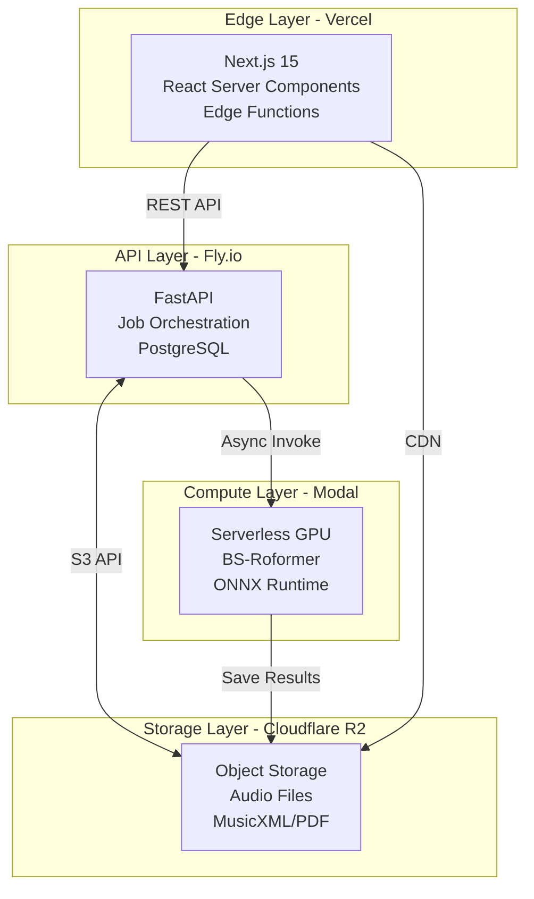
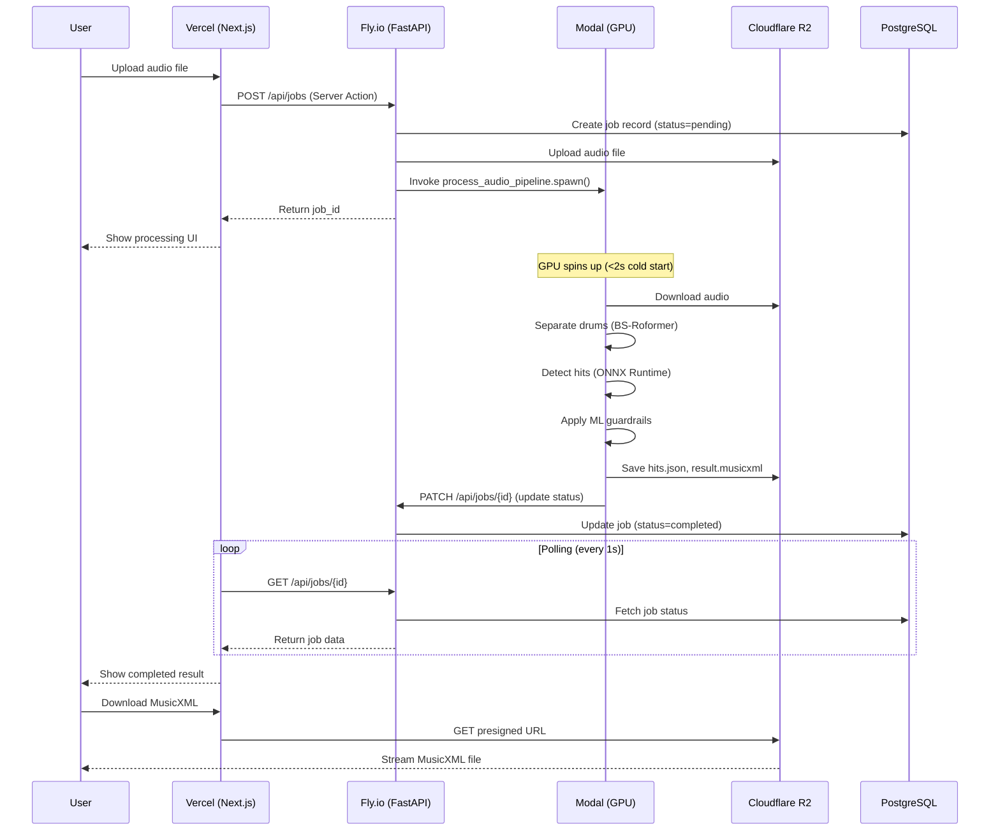
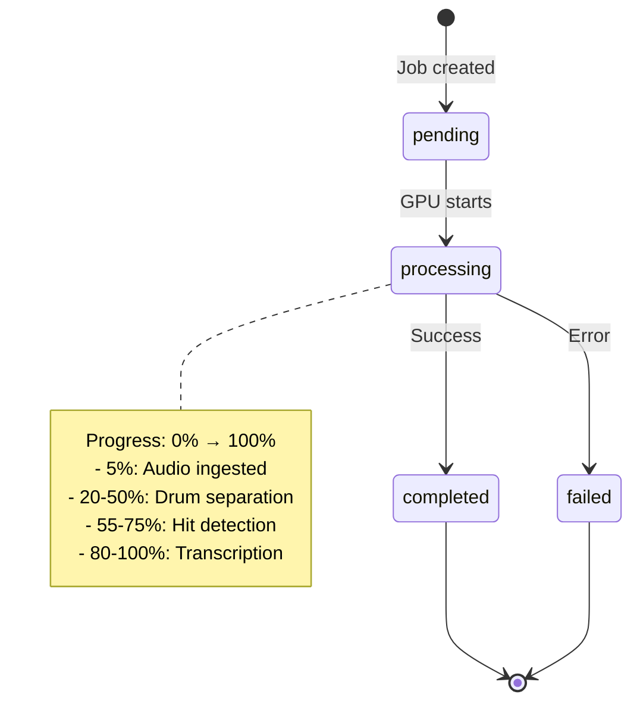

# System Architecture

**DrumScribe** — Decoupled Serverless Architecture for AI-Powered Drum Transcription

This document provides a comprehensive deep dive into DrumScribe's system design, focusing on the scale-to-zero serverless architecture that enables global deployment with minimal operational overhead.

---

## Table of Contents

- [Overview](#overview)
- [Architecture Principles](#architecture-principles)
- [Component Breakdown](#component-breakdown)
- [Data Flow](#data-flow)
- [Scale-to-Zero Economics](#scale-to-zero-economics)
- [Security](#security)
- [Performance Optimization](#performance-optimization)

---

## Overview

DrumScribe uses a **fully decoupled microservices architecture** where each component scales independently and can be deployed to different cloud providers based on their strengths.

### High-Level Architecture



### Why This Architecture?

| Decision | Rationale |
|----------|-----------|
| **Vercel for Frontend** | Global edge network, automatic HTTPS, zero-config deployments, Next.js optimization |
| **Fly.io for API** | Global edge deployment, PostgreSQL included, WebSocket support, low latency |
| **Modal for ML** | Serverless GPUs, scale-to-zero, <2s cold starts, no infrastructure management |
| **Cloudflare R2 for Storage** | Zero egress fees (vs $0.09/GB on S3), S3-compatible API, global CDN |

---

## Architecture Principles

### 1. **Decoupling**

Each service communicates via well-defined APIs:
- Frontend ↔ API: REST + Server Actions
- API ↔ GPU: Async function invocation (Modal SDK)
- API ↔ Storage: S3-compatible API
- GPU ↔ Storage: Direct writes (no API bottleneck)

**Benefits:**
- Independent scaling
- Technology flexibility
- Fault isolation
- Easy testing

### 2. **Scale-to-Zero**

All components scale to zero when idle:
- **Vercel**: Edge functions scale automatically
- **Fly.io**: Machines scale to zero (configurable)
- **Modal**: Functions scale to zero immediately
- **Cloudflare R2**: Pay per storage + requests only

**Cost Impact:**
- Development: $0/month (all free tiers)
- Production (1000 tracks/month): ~$50/month
- vs. Always-on GPU: $432/month

### 3. **Edge-First**

Services deployed to global edge networks:
- **Vercel**: 100+ edge locations
- **Fly.io**: 30+ regions worldwide
- **Cloudflare R2**: Global CDN

**Latency:**
- API calls: <100ms globally
- Asset delivery: <50ms via CDN
- GPU inference: Regional (optimized for cost)

### 4. **Observability**

Structured logging and tracing throughout:
- **Frontend**: Vercel Analytics
- **API**: Structured JSON logs (structlog)
- **GPU**: Modal logs + metrics
- **Correlation**: Job IDs trace entire pipeline

---

## Component Breakdown

### Frontend (Vercel + Next.js 15)

**Technology Stack:**
- Next.js 15 (App Router)
- React 19 (Server Components)
- TanStack Query (State management)
- OpenSheetMusicDisplay (Sheet music rendering)
- Tailwind CSS + shadcn/ui

**Key Features:**

**1. Server Actions for Job Creation**
```typescript
// app/actions/jobs.ts
'use server'

export async function createJob(formData: FormData) {
  const file = formData.get('audio') as File
  
  // Server-side API call (no CORS)
  const response = await fetch(`${process.env.API_URL}/api/jobs`, {
    method: 'POST',
    body: formData,
  })
  
  return response.json()
}
```

**Benefits:**
- No CORS configuration needed
- Secure API calls (server-side only)
- Progressive enhancement
- Type-safe with TypeScript

**2. Real-Time Polling with TanStack Query**
```typescript
// hooks/useJobPolling.ts
export function useJobPolling(jobId: string) {
  return useQuery({
    queryKey: ['job', jobId],
    queryFn: () => fetchJob(jobId),
    refetchInterval: (data) => {
      if (data?.status === 'completed') return false
      if (data?.status === 'failed') return false
      return 1000 // Poll every second
    },
  })
}
```

**3. Interactive Sheet Music**
- OpenSheetMusicDisplay for MusicXML rendering
- Zoom, pan, note highlighting
- Audio playback synchronized with notation
- Export to PDF client-side

**Deployment:**
```bash
# Automatic deployment on git push
vercel --prod

# Environment variables
NEXT_PUBLIC_API_URL=https://api.drumscribe.ai
```

---

### API Layer (Fly.io + FastAPI)

**Technology Stack:**
- FastAPI (Python 3.11)
- PostgreSQL 16
- SQLAlchemy (async ORM)
- Pydantic v2 (validation)
- structlog (JSON logging)

**Responsibilities:**
1. Job lifecycle management (create, poll, cancel)
2. File upload handling
3. Modal GPU orchestration
4. Storage management (Cloudflare R2)
5. Health checks and metrics

**Key Endpoints:**

**1. Job Creation**
```python
@router.post("/jobs", response_model=JobResponse)
async def create_job(
    audio: UploadFile = File(...),
    user_bpm: Optional[int] = None,
    db: AsyncSession = Depends(get_db),
):
    # 1. Validate audio file
    validate_audio_file(audio)
    
    # 2. Create job record
    job = Job(status="pending", user_bpm=user_bpm)
    db.add(job)
    await db.commit()
    
    # 3. Upload to R2
    audio_url = await storage.upload(job.id, audio)
    
    # 4. Trigger Modal GPU processing
    if settings.USE_MODAL:
        modal_client.process_audio.spawn(
            job_id=job.id,
            audio_url=audio_url,
            user_bpm=user_bpm,
        )
    
    return job
```

**2. Job Polling**
```python
@router.get("/jobs/{job_id}", response_model=JobResponse)
async def get_job(
    job_id: str,
    db: AsyncSession = Depends(get_db),
):
    job = await db.get(Job, job_id)
    if not job:
        raise HTTPException(404, "Job not found")
    
    return JobResponse(
        id=job.id,
        status=job.status,
        progress=job.progress,
        detected_bpm=job.detected_bpm,
        confidence_score=job.confidence_score,
        created_at=job.created_at,
    )
```

**Database Schema:**
```sql
CREATE TABLE jobs (
    id UUID PRIMARY KEY,
    status VARCHAR(20) NOT NULL,  -- pending, processing, completed, failed
    progress INTEGER DEFAULT 0,    -- 0-100
    detected_bpm INTEGER,
    bpm_unreliable BOOLEAN,
    confidence_score FLOAT,
    user_bpm INTEGER,
    error_message TEXT,
    created_at TIMESTAMP DEFAULT NOW(),
    updated_at TIMESTAMP DEFAULT NOW()
);

CREATE INDEX idx_jobs_status ON jobs(status);
CREATE INDEX idx_jobs_created_at ON jobs(created_at);
```

**Deployment:**
```bash
# Deploy to Fly.io
fly deploy

# Scale to zero when idle
fly scale count 0 --min-machines-running 0

# Environment variables
DATABASE_URL=postgres://...
STORAGE_BACKEND=s3
S3_BUCKET=drumscribe-artifacts
S3_ENDPOINT_URL=https://...r2.cloudflarestorage.com
USE_MODAL=true
```

---

### Compute Layer (Modal + Serverless GPU)

**Technology Stack:**
- Modal (Serverless GPU platform)
- NVIDIA T4 GPUs
- PyTorch + torchaudio
- ONNX Runtime
- audio-separator[gpu] (BS-Roformer)

**Architecture:**

```python
# backend/infrastructure/modal_app.py
import modal

app = modal.App("drumscribe-ml")

# Pre-cache model weights during image build
image = (
    modal.Image.debian_slim(python_version="3.11")
    .apt_install("ffmpeg", "libsndfile1")
    .pip_install("torch", "torchaudio", "transformers", "onnxruntime-gpu")
    .run_function(download_model_weights, gpu="T4")  # Critical optimization
)

@app.function(
    image=image,
    gpu="T4",
    timeout=600,
    memory=8192,
)
def process_audio_pipeline(
    job_id: str,
    audio_url: str,
    user_bpm: Optional[int] = None,
) -> Dict[str, Any]:
    # 1. Download audio from R2
    # 2. Separate drums (BS-Roformer)
    # 3. Detect hits (ONNX Runtime)
    # 4. Apply guardrails
    # 5. Save results to R2
    # 6. Update job status via API
    pass
```

**Cold Start Optimization:**

The `download_model_weights()` function runs **once during image build**, not on every invocation:

```python
def download_model_weights():
    # Download AST model (~350MB)
    from transformers import ASTForAudioClassification
    ASTForAudioClassification.from_pretrained("MIT/ast-finetuned-audioset-10-10-0.4593")
    
    # Download BS-Roformer checkpoint (~350MB)
    from audio_separator.separator import Separator
    separator = Separator(model_file_dir="/root/model_cache")
    separator.load_model("model_bs_roformer_ep_368_sdr_12.9628.ckpt")
```

**Impact:**
- Without caching: 30-60s cold start
- With caching: <2s cold start
- **Savings: $0.50-$1.00 per cold start** (GPU idle time eliminated)

**Deployment:**
```bash
# Deploy Modal app
modal deploy backend/infrastructure/modal_app.py

# Test function
modal run backend/infrastructure/modal_app.py --audio-url "https://..."
```

---

### Storage Layer (Cloudflare R2)

**Why Cloudflare R2?**

| Feature | Cloudflare R2 | AWS S3 | Savings |
|---------|--------------|--------|---------|
| **Storage** | $0.015/GB/month | $0.023/GB/month | 35% cheaper |
| **Egress** | **$0** | $0.09/GB | **100% savings** |
| **Requests** | $0.36/million | $0.40/million | 10% cheaper |

**For 1000 tracks/month:**
- Audio files: ~5GB storage
- MusicXML/PDF: ~500MB storage
- Downloads: ~10GB egress

**Cost:**
- R2: $0.08/month storage + $0 egress = **$0.08/month**
- S3: $0.13/month storage + $0.90 egress = **$1.03/month**
- **Savings: 92%**

**Configuration:**

```python
# backend/app/storage/s3.py
import boto3

s3_client = boto3.client(
    's3',
    endpoint_url=settings.S3_ENDPOINT_URL,  # R2 endpoint
    aws_access_key_id=settings.S3_ACCESS_KEY_ID,
    aws_secret_access_key=settings.S3_SECRET_ACCESS_KEY,
    region_name='auto',  # R2 uses 'auto'
)

# Upload audio
s3_client.upload_fileobj(
    audio_file,
    settings.S3_BUCKET,
    f"jobs/{job_id}/audio.mp3",
)

# Generate presigned URL (1 hour expiry)
url = s3_client.generate_presigned_url(
    'get_object',
    Params={'Bucket': settings.S3_BUCKET, 'Key': f"jobs/{job_id}/result.musicxml"},
    ExpiresIn=3600,
)
```

**Bucket Structure:**
```
drumscribe-artifacts/
├── jobs/
│   ├── {job_id}/
│   │   ├── audio.mp3           # Original upload
│   │   ├── drums.wav           # Separated drums
│   │   ├── hits.json           # ML predictions
│   │   ├── result.musicxml     # Sheet music
│   │   └── result.pdf          # PDF export
```

**Lifecycle Policy:**
```json
{
  "Rules": [
    {
      "Id": "DeleteOldJobs",
      "Status": "Enabled",
      "Expiration": {
        "Days": 7
      },
      "Filter": {
        "Prefix": "jobs/"
      }
    }
  ]
}
```

---

## Data Flow

### Complete Request Lifecycle



### State Transitions



---

## Scale-to-Zero Economics

### Cost Breakdown (1000 tracks/month)

| Component | Always-On | Serverless | Savings |
|-----------|-----------|------------|---------|
| **Frontend** (Vercel) | $0 (free tier) | $0 (free tier) | — |
| **API** (Fly.io) | $0 (free tier) | $0 (free tier) | — |
| **GPU** (Modal vs AWS) | $432/month | $35-55/month | **87-92%** |
| **Storage** (R2 vs S3) | $1.03/month | $0.08/month | **92%** |
| **Total** | **$433/month** | **$35-55/month** | **87-92%** |

### Per-Track Economics

**Serverless (Modal):**
- Inference time: 30-120s per track
- GPU cost: $0.60/hour = $0.01/minute
- Average cost: $0.02-$0.04 per track

**Always-On (AWS g4dn.xlarge):**
- Fixed cost: $432/month
- Break-even: ~15,000 tracks/month
- Below break-even: Wasted capacity

**Conclusion:** Serverless is optimal for <10,000 tracks/month.

---

## Security

### Authentication & Authorization

**API Keys:**
```python
# backend/app/core/security.py
from fastapi import Security, HTTPException
from fastapi.security import HTTPBearer

security = HTTPBearer()

async def verify_api_key(credentials: HTTPAuthorizationCredentials = Security(security)):
    if credentials.credentials != settings.API_KEY:
        raise HTTPException(403, "Invalid API key")
    return credentials.credentials
```

**Rate Limiting:**
```python
from slowapi import Limiter
from slowapi.util import get_remote_address

limiter = Limiter(key_func=get_remote_address)

@app.post("/api/jobs")
@limiter.limit("10/minute")
async def create_job(...):
    pass
```

### CORS Configuration

```python
from fastapi.middleware.cors import CORSMiddleware

app.add_middleware(
    CORSMiddleware,
    allow_origins=settings.CORS_ORIGINS,  # ["https://drumscribe.ai"]
    allow_credentials=True,
    allow_methods=["GET", "POST", "DELETE"],
    allow_headers=["*"],
)
```

### Data Privacy

- **Audio files**: Auto-deleted after 7 days (R2 lifecycle policy)
- **Job records**: Soft-deleted after 30 days
- **No PII collected**: Anonymous usage only
- **HTTPS everywhere**: TLS 1.3 enforced

---

## Performance Optimization

### Frontend Optimization

**1. Server Components (React 19)**
```tsx
// app/jobs/[id]/page.tsx
export default async function JobPage({ params }: { params: { id: string } }) {
  // Server-side data fetching (no client bundle)
  const job = await fetchJob(params.id)
  
  return <JobDetails job={job} />
}
```

**2. Incremental Static Regeneration**
```tsx
export const revalidate = 60 // Revalidate every 60 seconds
```

**3. Image Optimization**
```tsx
import Image from 'next/image'

<Image
  src="/screenshot.png"
  width={800}
  height={600}
  alt="DrumScribe"
  loading="lazy"
/>
```

### API Optimization

**1. Database Connection Pooling**
```python
engine = create_async_engine(
    settings.DATABASE_URL,
    pool_size=20,
    max_overflow=10,
    pool_pre_ping=True,
)
```

**2. Async I/O**
```python
async def process_jobs():
    async with httpx.AsyncClient() as client:
        tasks = [client.get(url) for url in urls]
        results = await asyncio.gather(*tasks)
```

**3. Response Caching**
```python
from fastapi_cache import FastAPICache
from fastapi_cache.backends.redis import RedisBackend

@app.get("/api/jobs/{id}")
@cache(expire=60)
async def get_job(id: str):
    pass
```

### GPU Optimization

**1. ONNX Compilation**
- 2.7x faster inference vs PyTorch
- 40% memory reduction
- Dynamic axes for variable-length audio

**2. Weight Caching**
- Models baked into Docker image
- <2s cold starts (vs 30-60s without)
- $0.50-$1.00 saved per cold start

**3. Batch Processing**
```python
# Process multiple onset clips in batches
batch_size = 32
for i in range(0, len(clips), batch_size):
    batch = clips[i:i + batch_size]
    outputs = ort_session.run(None, {"input_values": batch})
```

---

## Monitoring & Observability

### Structured Logging

```python
import structlog

logger = structlog.get_logger()

logger.info(
    "job_created",
    job_id=job.id,
    user_bpm=user_bpm,
    file_size=audio.size,
)
```

### Health Checks

```python
@app.get("/api/health")
async def health_check():
    return {
        "status": "healthy",
        "database": await check_database(),
        "storage": await check_storage(),
        "modal": await check_modal(),
    }
```

### Metrics

```python
from prometheus_client import Counter, Histogram

job_counter = Counter('jobs_total', 'Total jobs created')
inference_duration = Histogram('inference_duration_seconds', 'GPU inference time')

@app.post("/api/jobs")
async def create_job(...):
    job_counter.inc()
    with inference_duration.time():
        await process_audio()
```

---

## Related Documentation

- **[ML Pipeline Deep Dive](ML_PIPELINE.md)** — torchaudio → ONNX → symusic
- **[Modal Deployment Guide](MODAL_DEPLOYMENT.md)** — Serverless GPU setup
- **[Production Deployment](DEPLOYMENT.md)** — Vercel, Fly.io, R2 configuration
- **[API Reference](API_REFERENCE.md)** — Complete REST API documentation

---

**Last Updated:** March 2026
